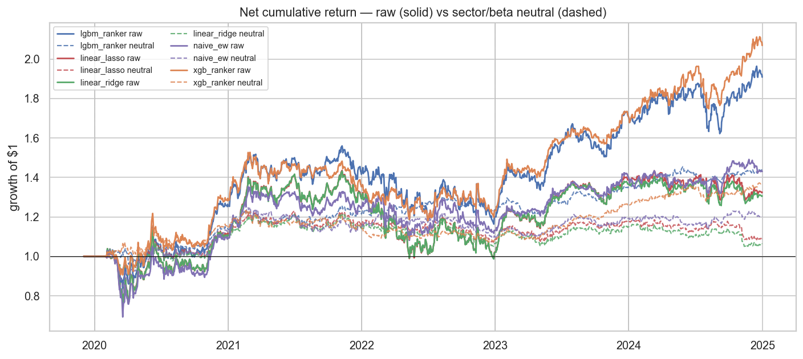

# ml-cross-sectional

> **Languages**: **English** · [繁體中文](docs/README.zh-TW.md)

I trained LightGBM and XGBoost as cross-sectional rankers on the S&P 500 with twelve OHLCV-derived features, validated annually walk-forward, attributed with SHAP, and backtested a quintile long-short net of realistic costs. The setup is intentionally vanilla — what I cared about was whether a tree adds anything you can't get from a hand-crafted equal-weight baseline on the same features.

Research framework: [`qtools`](https://github.com/matthiola0/qtools). Companion study:
[`classic-factors`](https://github.com/matthiola0/classic-factors).

## Headline result

XGBRanker on twelve price-volume features: **15.4% annualised return, 0.87 net Sharpe, −24% max drawdown** on a quintile long-short over 2020–2024, net of 5 bps one-way costs. Roughly 2× the Sharpe and 2× the return of a hand-crafted equal-weight baseline built from the three features with positive IC-IR in EDA.

One big caveat: universe is survivorship-biased, and 2022's rate-hike regime was negative for every model.

## Research question

I wanted to know whether a gradient-boosted ranker can systematically beat a hand-crafted equal-weight baseline using the same feature set — after costs and across regime changes. But the more interesting question turned out to be *why* it beats it. SHAP makes the gap legible: the tree is doing something a linear model structurally cannot on this feature set, not just fitting more parameters to the same signal.

## Scope

| | |
|---|---|
| Universe | 502 current S&P 500 constituents |
| Period | 2015-01-02 → 2025-07-30 (train + OOS) |
| OOS window | 2020 → 2024 (5 years, 1,258 trading days) |
| Target | Forward 21-day cross-sectional rank of returns |
| Features | 12 price-volume features — 3 classic factor signals + 4 multi-horizon returns + 2 realised-vol windows + RSI + MACD + volume z-score |
| Models | Ridge · Lasso · LightGBM `LGBMRanker` · XGBoost `XGBRanker` · handmade equal-weight baseline |
| Validation | Annual expanding-window walk-forward, no purge |
| Cost model | `qtools.backtest.costs.US_EQUITY` (1 bp commission + 4 bps slippage = 5 bps one-way) |

The fundamentals-based features (P/B, P/E, ROE) are
intentionally out of scope: `qtools` has no fundamentals loader yet, and
this study confines itself to signals derivable from OHLCV.

## Results

### Feature EDA — [notebook 01](notebooks/01_feature_eda.ipynb)

Single-feature Spearman IC vs 21-day forward rank, 2015 → 2025. Top and
bottom shown; full table in the notebook.

| Feature | mean IC | IC-IR | t-stat | reading |
|---|---|---|---|---|
| `size_adv_60` | +0.016 | **+0.16** | 8.1 | Small-ADV premium alive on S&P 500 |
| `vol_60d` | +0.029 | +0.12 | 6.2 | **Low-vol anomaly reversed** — high-vol wins |
| `vol_20d` | +0.025 | +0.12 | 5.9 | same |
| `reversal_1w` | +0.013 | +0.08 | 3.9 | Short-term reversal survives |
| `mom_12_1` | −0.002 | −0.01 | −0.5 | **12-1 momentum has decayed to noise** post-2015 |
| `rsi_14` | −0.016 | −0.10 | −5.0 | Reads as *reversal*, not momentum |
| `low_vol_60` | −0.029 | −0.12 | −6.1 | ρ = −0.999 with `vol_60d` (sign-flipped duplicate, dropped) |

The 12-1 momentum decay reproduces the `classic-factors` result independently — same universe, different codebase, same conclusion.

### Walk-forward training — [notebook 02](notebooks/02_training_walkforward.ipynb)

Per-date OOS Spearman IC vs fwd 21-day rank, pooled 2020–2024:

| Model | mean IC | IC-IR | t-stat | hit rate |
|---|---|---|---|---|
| `xgb_ranker` | 0.037 | **0.20** | 6.9 | 56.7% |
| `lgbm_ranker` | 0.031 | 0.14 | 5.1 | 54.5% |
| `naive_ew` | 0.021 | 0.11 | 4.0 | 52.6% |
| `linear_lasso` | 0.017 | 0.07 | 2.6 | 49.0% |
| `linear_ridge` | 0.016 | 0.07 | 2.6 | 49.6% |

Per-year IC surfaces the regime story — `naive_ew` is the only model
holding up through 2022:

| Year | XGB | LGBM | naive | lasso | ridge |
|---|---|---|---|---|---|
| 2020 (COVID) | **+0.093** | +0.074 | +0.055 | +0.052 | +0.051 |
| 2021 (low-vol bull) | −0.022 | +0.010 | +0.008 | +0.025 | +0.025 |
| 2022 (rate hike) | −0.007 | −0.031 | +0.005 | −0.035 | −0.035 |
| 2023 (AI rally) | +0.058 | +0.054 | +0.031 | +0.047 | +0.045 |
| 2024 (AI rally) | +0.061 | +0.047 | +0.007 | −0.006 | −0.006 |

### SHAP attribution — [notebook 03](notebooks/03_shap_analysis.ipynb)

TreeExplainer applied to a 10,080-row stratified sample from 2024 OOS.
Top-ranked features by mean |SHAP|:

| Rank | Feature | mean |SHAP| | In `naive_ew`? |
|---|---|---|---|
| 1 | `size_adv_60` | 0.149 | ✓ |
| 2 | `vol_60d` | 0.087 | ✓ |
| 3 | `ret_126d` | **0.065** | ✗ |
| 4 | `ret_252d` | 0.046 | ✗ |
| 5 | `mom_12_1` | 0.029 | ✗ |
| 11 | `reversal_1w` | 0.005 | ✓ |
| 12 | `volume_z_60` | 0.001 | ✗ |

About 55% of global |SHAP| lives on the three `naive_ew` features; the other 45% is on the remaining nine. The interesting one is `ret_126d`: single-feature IC-IR of −0.03, almost useless alone, yet it ranks 3rd by mean |SHAP|. The tree uses it conditionally — only in specific size and vol buckets does it carry signal. That's the textbook case where a tree strictly dominates a linear model on the same feature set: not more features, just the ability to use them conditionally.

### Costed backtest — [notebook 04](notebooks/04_backtest.ipynb)

Quintile long-short, dollar-neutral, monthly rebalance, `US_EQUITY`
cost model (5 bps one-way). OOS 2020–2024.

| Model | Ann. Net Return | Net Sharpe | MDD | Avg Turnover | Cost drag / yr |
|---|---|---|---|---|---|
| `xgb_ranker` | **15.4%** | **0.87** | **−23.9%** | 159% | 94 bps |
| `lgbm_ranker` | 13.1% | 0.68 | −28.0% | 159% | 94 bps |
| `naive_ew` | 6.7% | 0.43 | −32.7% | 231% | 136 bps |
| `linear_lasso` | 5.3% | 0.34 | −33.1% | 218% | 129 bps |
| `linear_ridge` | 5.2% | 0.34 | −33.2% | 221% | 130 bps |

Two things worth flagging against the "ML is expensive to trade" intuition: the tree models have *lower* turnover (159%) than the handmade baseline (231%), because threshold-split quintile boundaries change membership less often than a sum of z-scored features that re-normalise every month. And the tree models have smaller max drawdown (−24% for XGB vs −33% for the baseline) — the ML quintile is more diversified within each leg, which dampens the 2022 concentration blowups.

Net Sharpe by year:

| Year | XGB | LGBM | naive | lasso | ridge |
|---|---|---|---|---|---|
| 2020 | **1.10** | 1.01 | 0.42 | 0.46 | 0.44 |
| 2021 | 0.38 | 0.64 | 0.82 | **0.90** | 0.93 |
| 2022 | −0.39 | −0.51 | **−0.41** | −0.73 | −0.70 |
| 2023 | **2.99** | 2.36 | 1.99 | 2.12 | 2.08 |
| 2024 | **1.34** | 0.77 | 0.23 | −0.21 | −0.19 |


### Cross-universe robustness — [notebook 05](notebooks/05_robustness_tw_btc.ipynb)

Same 12 features, same XGB ranker, re-trained on Taiwan 0050 (50 names) and
on a hard-coded universe of 20 liquid USDT pairs on Binance (2018–2025,
OOS 2022–2024).

| Universe | XGB IC-IR | XGB Net Sharpe | `naive_ew` IC-IR | `naive_ew` Net Sharpe |
|---|---|---|---|---|
| US (502 names, 2020–2024) | +0.20 | +0.87 | +0.11 | +0.43 |
| TW 0050 (50 names, 2020–2024) | **+0.30** | +0.71 | +0.06 | +0.28 |
| BTC-uni (20 names, 2022–2024) | +0.18 | +0.74 | **−0.39** | **−0.22** |

The `naive_ew` failure on BTC is the key observation. The three handmade features carry the *wrong* sign in crypto — small tokens underperform, low-vol wins, momentum beats reversal. XGB learns those sign flips at training time and still posts positive IC-IR. Universe size (20 vs 500 names) turns out to matter less than whether the hand-crafted feature signs match the market's actual factor structure.

TW has the strongest IC-IR of the three universes (+0.30), and the 46 bps round-trip `TW_EQUITY` cost takes Sharpe from 0.90 gross to 0.71 net — a ~21% haircut, vs 6% on US. Costs are meaningful but not lethal at monthly rebalance: the IC is real and the strategy is tradeable in Taiwan, just with a noticeably tighter cost margin than the US analogue.

### Sector / beta neutralised — [notebook 06](notebooks/06_neutralized_backtest.ipynb)

The obvious attack on the headline 0.87 Sharpe is "the alpha is just sector and beta drift the model absorbed from the training data". This notebook closes that hole: per cross-section, regress raw score on GICS sector dummies (10) and 252-day rolling beta vs SPY, use the residual as the neutralised score, then re-run the **identical** backtest — same universe, same window, same 5 bps one-way cost.

| Model | Raw Sharpe | Neutral Sharpe | Raw Ret | Neutral Ret | Survival | Raw MDD | Neutral MDD |
|---|---|---|---|---|---|---|---|
| `xgb_ranker` | 0.87 | 0.76 | 15.4% | 6.4% | **41%** | −22.7% | **−13.0%** |
| `lgbm_ranker` | 0.70 | **0.85** | 13.6% | 7.4% | **55%** | −25.4% | **−7.9%** |
| `naive_ew` | 0.46 | 0.39 | 7.3% | 3.7% | 50% | −32.8% | −19.6% |
| `linear_lasso` | 0.36 | 0.22 | 5.7% | 1.8% | 32% | −31.1% | −12.8% |
| `linear_ridge` | 0.35 | 0.17 | 5.4% | 1.3% | **23%** | −31.1% | −13.5% |

Three things worth pulling out from these numbers:

LGBM Sharpe goes *up* after neutralisation (0.70 → 0.85) — counter-intuitive, but the mechanism is simple. The raw version was carrying sector and beta drift in 2022 that *cost* it Sharpe; stripping that drift turns 2022 from −0.51 to +0.25. The MDD drop from −25% to −8% is the same effect. Stripping the bad exposure actually improved the risk-adjusted number.

XGB net return halves (15.4% → 6.4%) but Sharpe only drops 13% (0.87 → 0.76) — vol falls in tandem with return. The honest read: 6.4% is real stock-picking; the other 9 pts was sector and high-beta tilt. Smaller, but real.

Linear baselines lose 70–80% of their edge after neutralisation (Ridge 23% survival, Lasso 32%). They were loading on factor exposure, not picking stocks — confirming that a regularised linear with this 12-feature set is dominated by the small-ADV + high-vol axis, which is correlated with sector and beta.

Per-year net Sharpe (neutralised) — compare with the raw table above:

| Year | XGB | LGBM | naive | lasso | ridge |
|---|---|---|---|---|---|
| 2020 | 1.19 | 1.05 | 0.83 | 0.73 | 0.70 |
| 2021 | −0.01 | 0.77 | 0.24 | 0.42 | 0.35 |
| 2022 | −0.70 | **0.25** | −0.32 | −0.54 | −0.59 |
| 2023 | **2.46** | 1.35 | 1.13 | 0.93 | 0.89 |
| 2024 | 1.12 | 1.01 | 0.14 | −0.80 | −0.91 |

XGB's 2023 stays at 2.46 — so the AI-rally edge was *not* purely sector
loading on Information Technology — but linear models flip from positive
to large negatives in 2024, telling me their "edge" was riding a sector
trend rather than picking the right names within sectors.

One thing this notebook doesn't claim: a real PM would solve a sector- and beta-constrained optimisation, not residualise and rebalance. Constraint formulation preserves more alpha because it permits any position consistent with the constraints; residualisation is the conservative version (any alpha *correlated* with sector/beta gets stripped, even if incidentally). The survivorship and point-in-time membership caveats from notebook 04 still apply.



## Failure modes

2022 is a shared negative-Sharpe year for every model. The rate-hike drawdown rotated against small-cap/high-vol exposure — the dominant axis all five signals load on — and nothing in a pure OHLCV feature set can see the macro environment. `ml-return-forecast` was designed partly to address this by adding VIX, yields, and credit spread.

XGB underperforms the linear baselines in 2021 (net Sharpe 0.38 vs 0.90). In smooth continuation regimes, the tree's splits — trained heavily on COVID-era data — appear to over-fit the 2020 reversal pattern and miss the 2021 continuation. A fold-weighted ensemble of XGB and Lasso would probably handle this better than XGB alone.

Linear baselines lose to `naive_ew` (IC-IR 0.07 vs 0.11). The 12-feature set contains four features with wrong-sign IC (`rsi_14`, `ret_21d`, `macd_hist`, `ret_63d`) that a tree simply doesn't split on, but that a regularised linear regression still has to assign coefficients to. Lasso at α = 1 × 10⁻⁴ wasn't strong enough to zero them out. Pre-filtering the linear feature set to only positive-IC-IR features would be a fairer comparison.

## Limitations

Universe is current S&P 500 membership — names removed during 2020–2024 are invisible, which biases net Sharpe upward by roughly 10–20%. Sector and beta neutralisation is addressed in notebook 06: 41–55% of the tree-model edge survives, ~25–30% of the linear edge survives, MDD roughly halves. Notebook 04 numbers should be read alongside the neutralised table, not in isolation. Short borrow cost isn't modelled — typical GC borrow runs 50–100 bps/year on the short leg and would subtract directly from net return. Point-in-time index membership isn't modelled either: a name added to the index in 2022 gets weight in the 2015 history, which is a second look-ahead layered on top of survivorship.

## Layout

```
ml-cross-sectional/
├── src/mlcs/
│   ├── features.py             # technical + classic-factor signals
│   ├── model.py                # 5 ranker wrappers behind one fit/predict API
│   └── validation.py           # annual walk-forward splitter
├── scripts/
│   ├── download_data.py                 # qtools → data/raw/
│   ├── download_sector_beta.py          # Wikipedia GICS + 252d β vs SPY → data/processed/sector_beta.parquet
│   └── build_features.py                # → data/processed/features_*.parquet
├── notebooks/
│   ├── 01_feature_eda.ipynb
│   ├── 02_training_walkforward.ipynb
│   ├── 03_shap_analysis.ipynb
│   ├── 04_backtest.ipynb
│   ├── 05_robustness_tw_btc.ipynb
│   └── 06_neutralized_backtest.ipynb
└── reports/
    ├── figures/                # committed; referenced from README + notebooks
    └── predictions/            # OOS score parquet used by 03 and 04
```

## Notebook tour

- [`01_feature_eda.ipynb`](notebooks/01_feature_eda.ipynb) — single-feature Spearman IC and IC-IR for all 12 features, the duplicate-feature pruning (`low_vol_60` ρ = −0.999 with `vol_60d`), and the independent reproduction of the post-2015 12-1 momentum decay.
- [`02_training_walkforward.ipynb`](notebooks/02_training_walkforward.ipynb) — annual walk-forward training of all five models, pooled OOS IC table, and the per-year IC surface that exposes the 2022 regime where `naive_ew` is the only model still positive.
- [`03_shap_analysis.ipynb`](notebooks/03_shap_analysis.ipynb) — TreeExplainer on a stratified 2024 OOS sample. Headline finding: `ret_126d` ranks 3rd by mean |SHAP| despite single-feature IC-IR of −0.03, the textbook conditional-use case where trees beat linear on the same features.
- [`04_backtest.ipynb`](notebooks/04_backtest.ipynb) — quintile long-short, monthly rebalance, US_EQUITY cost. Net Sharpe table, per-year breakdown, equity curve. The headline 0.87 XGB Sharpe lives here.
- [`05_robustness_tw_btc.ipynb`](notebooks/05_robustness_tw_btc.ipynb) — same XGB ranker re-trained on TW 0050 and a 20-name BTC universe. The headline finding is `naive_ew` flipping sign on BTC while XGB still posts +0.74 Sharpe — the universe-vs-feature-structure result.
- [`06_neutralized_backtest.ipynb`](notebooks/06_neutralized_backtest.ipynb) — sector + 252d β residualisation, then re-run the identical backtest. Survival rates, MDD changes, and the LGBM 0.70 → 0.85 surprise.

## Reproducing

```bash
# Clone and install (qtools is pulled in automatically via pyproject.toml)
git clone https://github.com/matthiola0/ml-cross-sectional
cd ml-cross-sectional
conda create -n ml-cross-sectional python=3.13 -y
conda activate ml-cross-sectional
pip install -e .

# 1. Populate price cache (shared with classic-factors; cache hit if that ran)
python scripts/download_data.py                # ~5 min first run, instant if cached

# 2. Build feature matrix
python scripts/build_features.py               # → data/processed/features_*.parquet

# 2b. (notebook 06 only) GICS sectors + 252d rolling β vs SPY
python scripts/download_sector_beta.py         # → data/processed/sector_beta.parquet

# 3. Re-execute notebooks (walk-forward training is ~4 min; everything else < 1 min)
python -m ipykernel install --user --name ml-cross-sectional
jupyter nbconvert --to notebook --execute \
    --ExecutePreprocessor.kernel_name=ml-cross-sectional \
    --inplace notebooks/*.ipynb
```

**Local development.** If you also have a local clone of
[`qtools`](https://github.com/matthiola0/qtools) and want edits to
propagate without pushing, run `pip install -e ../qtools` to override the
git-installed copy with an editable local one.

## References

**Cross-sectional ML in asset pricing**
- Gu, S., Kelly, B., & Xiu, D. (2020). Empirical asset pricing via machine
  learning. *Review of Financial Studies*, 33(5), 2223–2273.
  [doi:10.1093/rfs/hhaa009](https://doi.org/10.1093/rfs/hhaa009) — benchmark
  comparison of linear vs tree vs neural-network forecasters for monthly
  US equity returns. This repo is **not** a direct reimplementation —
  we (i) predict cross-sectional rank via `LGBMRanker` / `XGBRanker`
  rather than absolute next-month return, (ii) use a 12-feature
  OHLCV-only set rather than their ~94 firm characteristics plus 8
  macro predictors, and (iii) emphasise post-cost evaluation over the
  OOS R² focus in the paper. An absolute-return regression study on the
  same universe aligned more closely with GKX is the subject of the
  companion `ml-return-forecast`.
- López de Prado, M. (2018). *Advances in financial machine learning*.
  Wiley. Chapter 7 argues that financial cross-validation should use
  purging + embargo (with CPCV as the recommended scheme). We use plain
  expanding-window annual walk-forward with **no purging** —
  justifiable at a 21-day target horizon and annual retrain (the
  gain from purging is dwarfed by fold-to-fold IC noise), but a
  deliberate deviation from the book's recommendation that a
  production setup should revisit.

**Feature attribution**
- Lundberg, S. M., & Lee, S.-I. (2017). A unified approach to interpreting
  model predictions. *NeurIPS 2017*. SHAP — used in notebook 03.

**Factor decay and costs**
- Novy-Marx, R., & Velikov, M. (2016). A taxonomy of anomalies and their
  trading costs. *Review of Financial Studies*, 29(1), 104–147.
  [doi:10.1093/rfs/hhv063](https://doi.org/10.1093/rfs/hhv063) — frames
  the "gross vs net Sharpe" question that notebook 04 answers for this
  specific model family.
- McLean, R. D., & Pontiff, J. (2016). Does academic research destroy
  stock return predictability? *Journal of Finance*, 71(1), 5–32.
  [doi:10.1111/jofi.12365](https://doi.org/10.1111/jofi.12365) —
  the "momentum has decayed post-2015" reading of our EDA is a specific
  instance of the factor-crowding thesis documented here.

**Low-vol anomaly**
- Baker, M., Bradley, B., & Wurgler, J. (2011). Benchmarks as limits to
  arbitrage: Understanding the low-volatility anomaly. *Financial
  Analysts Journal*, 67(1), 40–54. [doi:10.2469/faj.v67.n1.4](https://doi.org/10.2469/faj.v67.n1.4)
  — our EDA finds the anomaly *reversed* (high-vol outperforms) in the
  2015–2025 S&P 500 sample; this paper is the reference against which
  the reversal should be framed in any serious write-up.
