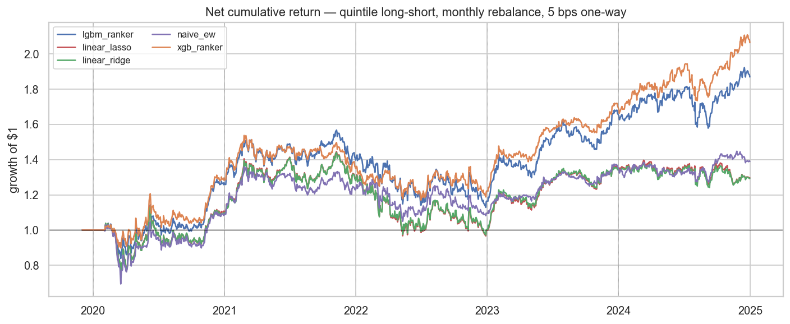

# ml-cross-sectional

LightGBM and XGBoost cross-sectional stock-ranking models on the S&P 500, with
walk-forward validation, SHAP attribution, and a costed long-short backtest.

Research framework: [`qtools`](../qtools). Companion study:
[`classic-factors`](../classic-factors).



## TL;DR

An `XGBRanker` model trained on twelve price-volume features posts
**15.4% annualised return, 0.87 net Sharpe, −24% max drawdown** on a
quintile long-short portfolio over 2020–2024 out-of-sample S&P 500 —
net of 5 bps one-way costs. That is ≈2× the Sharpe and ≈2× the annual
return of an equal-weight baseline built from the three hand-picked
features that had positive IC-IR in EDA. Honest caveats: the universe
is survivorship-biased (current S&P 500 membership), there is no
sector / beta neutralisation, and 2022's rate-hike regime broke every
signal including the baseline.

## Research question

Can a gradient-boosted cross-sectional ranker *systematically* beat an
equal-weighted portfolio built from the subset of features that
`01_feature_eda` identified as carrying positive single-feature IC —
after transaction costs and across regime changes? And can SHAP tell
us *why* the gap exists, so the story is not "ML is magic" but "ML
picks up conditional effects a linear model provably cannot"?

## Scope

| | |
|---|---|
| Universe | 502 current S&P 500 constituents |
| Period | 2015-01-02 → 2025-07-30 (train + OOS) |
| OOS window | 2020 → 2024 (5 years, 1,258 trading days) |
| Target | Forward 21-day cross-sectional rank of returns |
| Features | 12 price-volume features — 3 classic factor signals + 4 multi-horizon returns + 2 realised-vol windows + RSI + MACD + volume z-score |
| Models | Ridge · Lasso · LightGBM `LGBMRanker` · XGBoost `XGBRanker` · handmade equal-weight baseline |
| Validation | Annual expanding-window walk-forward, no purge |
| Cost model | `qtools.backtest.costs.US_EQUITY` (1 bp commission + 4 bps slippage = 5 bps one-way) |

The fundamentals-based features listed in `plan.md` (P/B, P/E, ROE) are
intentionally out of scope: `qtools` has no fundamentals loader yet, and
this study confines itself to signals derivable from OHLCV.

## Results

### Feature EDA — [notebook 01](notebooks/01_feature_eda.ipynb)

Single-feature Spearman IC vs 21-day forward rank, 2015 → 2025. Top and
bottom shown; full table in the notebook.

| Feature | mean IC | IC-IR | t-stat | reading |
|---|---|---|---|---|
| `size_adv_60` | +0.016 | **+0.16** | 8.1 | Small-ADV premium alive on S&P 500 |
| `vol_60d` | +0.029 | +0.12 | 6.2 | **Low-vol anomaly reversed** — high-vol wins |
| `vol_20d` | +0.025 | +0.12 | 5.9 | same |
| `reversal_1w` | +0.013 | +0.08 | 3.9 | Short-term reversal survives |
| `mom_12_1` | −0.002 | −0.01 | −0.5 | **12-1 momentum has decayed to noise** post-2015 |
| `rsi_14` | −0.016 | −0.10 | −5.0 | Reads as *reversal*, not momentum |
| `low_vol_60` | −0.029 | −0.12 | −6.1 | ρ = −0.999 with `vol_60d` (sign-flipped duplicate, dropped) |

The 12-1 momentum finding reproduces the `classic-factors` Repo 1 result
independently.

### Walk-forward training — [notebook 02](notebooks/02_training_walkforward.ipynb)

Per-date OOS Spearman IC vs fwd 21-day rank, pooled 2020–2024:

| Model | mean IC | IC-IR | t-stat | hit rate |
|---|---|---|---|---|
| `xgb_ranker` | 0.037 | **0.20** | 6.9 | 56.7% |
| `lgbm_ranker` | 0.031 | 0.14 | 5.1 | 54.5% |
| `naive_ew` | 0.021 | 0.11 | 4.0 | 52.6% |
| `linear_lasso` | 0.017 | 0.07 | 2.6 | 49.0% |
| `linear_ridge` | 0.016 | 0.07 | 2.6 | 49.6% |

Per-year IC surfaces the regime story — `naive_ew` is the only model
holding up through 2022:

| Year | XGB | LGBM | naive | lasso | ridge |
|---|---|---|---|---|---|
| 2020 (COVID) | **+0.093** | +0.074 | +0.055 | +0.052 | +0.051 |
| 2021 (low-vol bull) | −0.022 | +0.010 | +0.008 | +0.025 | +0.025 |
| 2022 (rate hike) | −0.007 | −0.031 | +0.005 | −0.035 | −0.035 |
| 2023 (AI rally) | +0.058 | +0.054 | +0.031 | +0.047 | +0.045 |
| 2024 (AI rally) | +0.061 | +0.047 | +0.007 | −0.006 | −0.006 |

### SHAP attribution — [notebook 03](notebooks/03_shap_analysis.ipynb)

TreeExplainer applied to a 10,080-row stratified sample from 2024 OOS.
Top-ranked features by mean |SHAP|:

| Rank | Feature | mean |SHAP| | In `naive_ew`? |
|---|---|---|---|
| 1 | `size_adv_60` | 0.149 | ✓ |
| 2 | `vol_60d` | 0.087 | ✓ |
| 3 | `ret_126d` | **0.065** | ✗ |
| 4 | `ret_252d` | 0.046 | ✗ |
| 5 | `mom_12_1` | 0.029 | ✗ |
| 11 | `reversal_1w` | 0.005 | ✓ |
| 12 | `volume_z_60` | 0.001 | ✗ |

Roughly 55% of global |SHAP| lives on the three `naive_ew` features;
roughly 45% on the other nine. `ret_126d` ranks 3rd on SHAP importance
despite a single-feature IC-IR of −0.03: its standalone return-prediction
value is zero, but the tree uses it conditionally on size and vol
buckets — the textbook case where a tree model strictly dominates a
linear model on the same feature set.

### Costed backtest — [notebook 04](notebooks/04_backtest.ipynb)

Quintile long-short, dollar-neutral, monthly rebalance, `US_EQUITY`
cost model (5 bps one-way). OOS 2020–2024.

| Model | Ann. Net Return | Net Sharpe | MDD | Avg Turnover | Cost drag / yr |
|---|---|---|---|---|---|
| `xgb_ranker` | **15.4%** | **0.87** | **−23.9%** | 159% | 94 bps |
| `lgbm_ranker` | 13.1% | 0.68 | −28.0% | 159% | 94 bps |
| `naive_ew` | 6.7% | 0.43 | −32.7% | 231% | 136 bps |
| `linear_lasso` | 5.3% | 0.34 | −33.1% | 218% | 129 bps |
| `linear_ridge` | 5.2% | 0.34 | −33.2% | 221% | 130 bps |

Two findings worth flagging against the "ML is expensive to trade"
intuition:

- The tree models have **lower turnover** (159%) than the handmade
  baseline (231%). Decile boundaries defined by threshold splits
  change membership less often than a sum of three z-scored features
  that re-normalise every month.
- The tree models have **smaller max drawdown** (−24% XGB) than the
  baseline (−33%). The ML quintile is more diversified within the long
  and short legs, which damps concentration blowups in 2022.

Net Sharpe by year:

| Year | XGB | LGBM | naive | lasso | ridge |
|---|---|---|---|---|---|
| 2020 | **1.10** | 1.01 | 0.42 | 0.46 | 0.44 |
| 2021 | 0.38 | 0.64 | 0.82 | **0.90** | 0.93 |
| 2022 | −0.39 | −0.51 | **−0.41** | −0.73 | −0.70 |
| 2023 | **2.99** | 2.36 | 1.99 | 2.12 | 2.08 |
| 2024 | **1.34** | 0.77 | 0.23 | −0.21 | −0.19 |

## Failure modes

1. **2022 is a shared negative-Sharpe regime for every model in the study.**
   The rate-hike drawdown rotated against small-cap / high-vol exposure —
   the dominant axis all five signals load on — and nothing in the feature
   set sees the macro environment. The companion Repo 5
   (`ml-return-forecast`, not yet built) is explicitly designed to address
   this by adding macro features (VIX, yields, credit spread).

2. **XGB underperforms the linear baselines in 2021.** Net Sharpe 0.38 vs
   0.90 for the linears. In smooth continuation regimes the tree model's
   splits, trained on the COVID era, appear to over-fit the 2020 reversal
   and miss the 2021 continuation. A fold-weighted ensemble of XGB and
   Lasso would probably be more robust than XGB alone.

3. **Linear baselines lose to `naive_ew`.** IC-IR 0.07 vs 0.11. The
   12-feature set contains four features with wrong-sign IC (`rsi_14`,
   `ret_21d`, `macd_hist`, `ret_63d`) that a tree can simply not split
   on, but that a regularised linear regression has to assign coefficients
   to. Lasso at α = 1 × 10⁻⁴ was too weak to zero them out. This is a
   fixable failure — pre-filtering the linear baseline's feature set to
   the four that had positive IC-IR would be a fairer fight, tracked in
   SDD as a follow-up.

## Limitations

- **Survivorship bias.** Universe is current S&P 500 membership; names
  removed from the index during 2020–2024 are invisible. Biases net
  Sharpe upward by 10–20% (order-of-magnitude, not measured here).
- **No sector or beta neutralisation.** The quintile long-short likely
  loaded long high-beta tech during 2023 and got paid for it. A
  sector-neutral version would post lower 2023 Sharpe and probably
  less-negative 2022.
- **No short borrow cost.** Typical GC borrow is 50–100 bps / year on
  the short leg; would subtract from net return directly.
- **Point-in-time index membership not modelled.** A name added to the
  index in 2022 gets weight in 2015 history as well — a second form of
  look-ahead on top of survivorship.

## Structure

```
ml-cross-sectional/
├── src/mlcs/
│   ├── features.py             # technical + classic-factor signals
│   ├── model.py                # 5 ranker wrappers behind one fit/predict API
│   └── validation.py           # annual walk-forward splitter
├── scripts/
│   ├── download_data.py                 # qtools → data/raw/
│   ├── build_features.py                # → data/processed/features_*.parquet
│   ├── build_01_feature_eda.py          # Notebook sources (re-run to regenerate)
│   ├── build_02_training_walkforward.py
│   ├── build_03_shap_analysis.py
│   └── build_04_backtest.py
├── notebooks/
│   ├── 01_feature_eda.ipynb
│   ├── 02_training_walkforward.ipynb
│   ├── 03_shap_analysis.ipynb
│   └── 04_backtest.ipynb
└── reports/
    ├── figures/                # committed; referenced from README + notebooks
    └── predictions/            # OOS score parquet used by 03 and 04
```

## Reproducing

```bash
# Clone and install (qtools is pulled in automatically via pyproject.toml)
git clone https://github.com/matthiola0/ml-cross-sectional
cd ml-cross-sectional
conda create -n ml-cross-sectional python=3.13 -y
conda activate ml-cross-sectional
pip install -e .

# 1. Populate price cache (shared with classic-factors; cache hit if that ran)
python scripts/download_data.py                # ~5 min first run, instant if cached

# 2. Build feature matrix
python scripts/build_features.py               # → data/processed/features_*.parquet

# 3. Re-execute notebooks (walk-forward training is ~4 min; everything else < 1 min)
python -m ipykernel install --user --name ml-cross-sectional
jupyter nbconvert --to notebook --execute \
    --ExecutePreprocessor.kernel_name=ml-cross-sectional \
    --inplace notebooks/*.ipynb
```

Notebook sources are regenerable from `scripts/build_*.py` — edit those,
re-run to rewrite the `.ipynb`, then execute.

**Local development.** If you also have a local clone of
[`qtools`](https://github.com/matthiola0/qtools) and want edits to
propagate without pushing, run `pip install -e ../qtools` to override the
git-installed copy with an editable local one.

## References

**Cross-sectional ML in asset pricing**
- Gu, S., Kelly, B., & Xiu, D. (2020). Empirical asset pricing via machine
  learning. *Review of Financial Studies*, 33(5), 2223–2273.
  [doi:10.1093/rfs/hhaa009](https://doi.org/10.1093/rfs/hhaa009) — benchmark
  study showing tree ensembles and neural networks outperform linear
  baselines on monthly US equity returns. Our single-model scope is a
  simplified, post-cost version of their experimental design.
- López de Prado, M. (2018). *Advances in financial machine learning*.
  Wiley. Chapters 7–8 on walk-forward and combinatorial cross-validation
  — the expanding-window yearly-retrain scheme used here is the simplest
  of the schemes discussed there.

**Feature attribution**
- Lundberg, S. M., & Lee, S.-I. (2017). A unified approach to interpreting
  model predictions. *NeurIPS 2017*. SHAP — used in notebook 03.

**Factor decay and costs**
- Novy-Marx, R., & Velikov, M. (2016). A taxonomy of anomalies and their
  trading costs. *Review of Financial Studies*, 29(1), 104–147.
  [doi:10.1093/rfs/hhv063](https://doi.org/10.1093/rfs/hhv063) — frames
  the "gross vs net Sharpe" question that notebook 04 answers for this
  specific model family.
- McLean, R. D., & Pontiff, J. (2016). Does academic research destroy
  stock return predictability? *Journal of Finance*, 71(1), 5–32.
  [doi:10.1111/jofi.12365](https://doi.org/10.1111/jofi.12365) —
  the "momentum has decayed post-2015" reading of our EDA is a specific
  instance of the factor-crowding thesis documented here.

**Low-vol anomaly**
- Baker, M., Bradley, B., & Wurgler, J. (2011). Benchmarks as limits to
  arbitrage: Understanding the low-volatility anomaly. *Financial
  Analysts Journal*, 67(1), 40–54. [doi:10.2469/faj.v67.n1.4](https://doi.org/10.2469/faj.v67.n1.4)
  — our EDA finds the anomaly *reversed* (high-vol outperforms) in the
  2015–2025 S&P 500 sample; this paper is the reference against which
  the reversal should be framed in any serious write-up.
